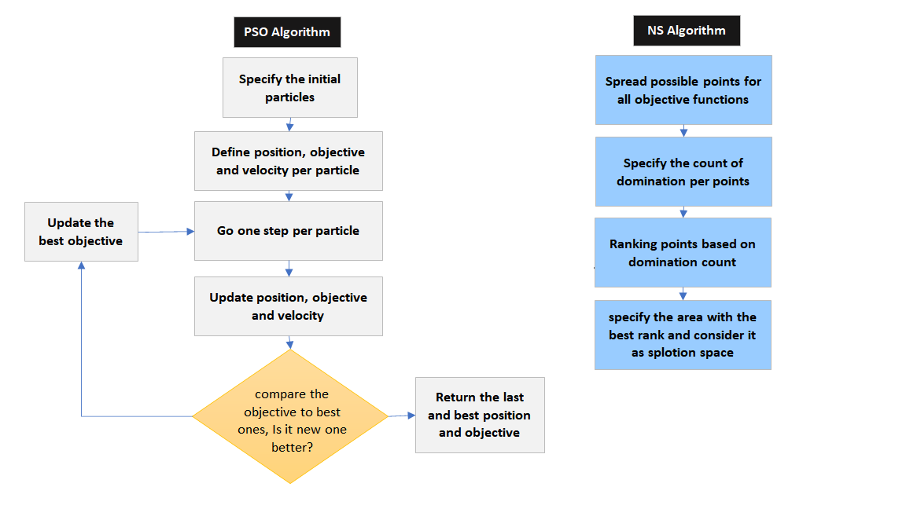

# Implementation of multiple objective rout optimization solving 

# 1- Introduction 
In real world whenever we encounter shipment planning in supply chain management, we have ploblems as how to schedule/allocate vehicles to target customers/vendors. This is an logistic distribution route optimization problem. In this program we will consider three major parts:
* **First:** designing  the intelligent optimization model whereas be able to accept different cases. The model can be multiple objective, can have cost functions and fitness functions, with constraints or without constraints.

* **Second:** solving the problem by and nondominated sorting metahuristic algorithm that here we choose PSO and GA.

* **Third:** compare the results and give output

# 2- Optimization model
In this program we have a complex model that cannot be solved by exact algorithms and we need to apply evolutionary algorithms. There are many of them in application of reasearches during last decade. The algorithm that we consider is particle swarm optimization(PSO) that the main concept comes from the movement of birds and fishes for searching a common target. tests

Here we are going to apply these two methods togrther for a multiple objective optimization model.

## 2-1- Parameter setting 
### 2-1-1 Input
In input file these parameters should be entered by users:

* node_count: number of nodes in distribution network
* truk_count: number of truks available daily
* $N_{i}=(x_{i},y_{i})$  $1<i<node_count$ : a matrix of having position of nodes
* o : Starting point of truks
* truck_capacity : capacity of truks
* $s_{i}$ : available stock in node i
### 2-1-2 Model variable
The solution in This model will result in having below variables:
* $x_{ij}$ : a binary vairable that show truck j has stop in node i or not $1<i<node_count$ $1<j<truk_coun$

$N_{i}=(x_{i},y_{i})$

## 2-2- Objective function

## 2-3- Hypothesis of model 

# 3- Methodology

## 3-1- 

# 4- Result