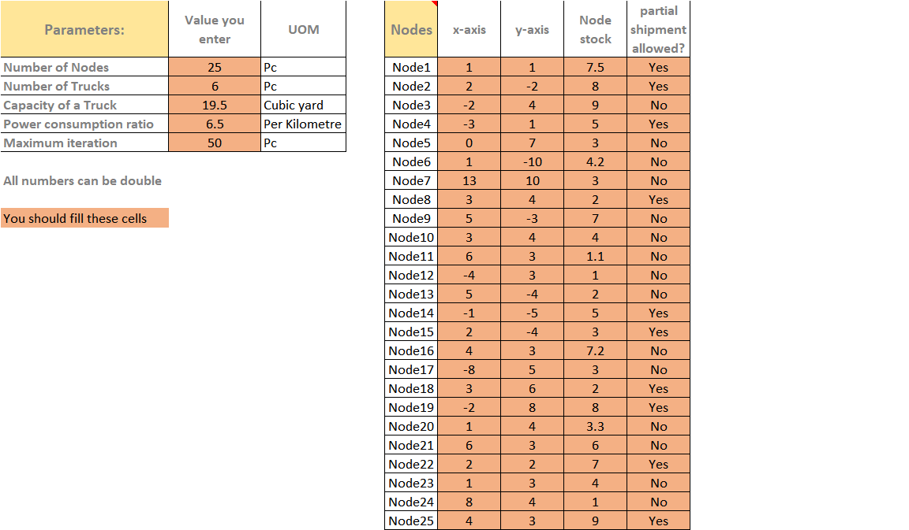

A non-dominated sorting PSO Algorithm in C++ to solve multiple objective Optimization Problems
==============

***The vehicle route and allocation optimization model is used for this program***

**Author:** *Paria Fakhrzad*

# Table of contents
1. [Introduction](#introduction)
2. [Optimization Model](#Optimization)
3. [Methodology](#Methodology)
4. [Result](#Result)
5. [Conclusion](#Conclusion)

# Introduction <a name="introduction"></a>
In the real-world whenever we encounter shipment planning in supply chain management, we have problems such as how to schedule/allocate vehicles to target customers/vendors' locations. This is a logistic distribution route optimization problem. The goal is to find the best allocation of vehicles with the minimum power consumption and maximum customers fulfillment.
Imagine we have just one vehicle and our target is just to minimize the distance, this is the simplest model of path optimization that one sample is traveling salesman problem. Here we consider a more complex model with  an increasing number of vehicle and multiple objectives.

In this program we will consider three major parts:

* **First:** designing the intelligent optimization model whereas being able to accept different cases. The model can be multiple objectives, can have cost functions and fitness functions, with constraints or without constraints.

* **Second:** solving the problem by non-dominated sorting meta-heuristic algorithm that here we choose PSO. There are two solutions here, first, the order of nodes are important, and second, the order of reaching each node is not matters.

* **Third:** comparing the results and give output.

#  Optimization model <a name="Optimization"></a>
In this program, we have a complex model that cannot be solved by exact algorithms and we need to apply evolutionary algorithms. There are many of them in the application of researches during last decade. The algorithm that we consider is particle swarm optimization(PSO) and the main concept comes from the movement of birds and fishes for searching a common target.


Here we are going to apply these two methods together for a multiple objective optimization models. 

## Parameter setting 
### Input parameters
In input file these parameters should be entered by users:

* node_count: number of nodes in distribution network
* truck_count: number of trucks available daily
* $N_{i}=(x_{i},y_{i})$  $1<i<node\_count$ : a matrix of having position of nodes
* o : Starting point of trucks
* truck_capacity : capacity of trucks
* $s_{i}$ : volume of available stock in node i
* f: power consumption ratio of unit distance
* $ps_{i}$ : a binary parameter to show if partial shipment is allowed in node i or not

###  Model variable
The solution in this model will result in having the below variables:
* $x_{ij}$ : a binary variable that show truck j has stop in node i or not $1<i<node\_count$  and $1<j<truck\_count$
* $F(x)$ : cost function of the model
* $G(x)$ : fitness function of the model

### Model set or parameter definitions
These sets/parameters will be defined during the algorithm steps:

* Distance_matrix :  a i-dimensional matrix of distances between nodes
* $d_{ik}$ distance between node i and k , $d_{ik}=d_{ki}$
* $P_{i}$ the fulfilled percentage of each node

## Objective function
The ost function here in this model is minimizing the sum of power consumption for all vehicles. the formula is:

$$F(x) =min \sum_{j=1}^{truk\_count}\sum_{i=1}^{node\_count} fd_{ik}$$

The fitness function in this model is to maximize the total percentage of customer fulfillment

$$G(x) =max \sum_{i=1}^{node\_count} P_{i}$$

## Hypothesis of model 
Since this model is complex so we assume the below assumption to make it simple:
- The condition of trucks can meet all stocks requirements
- The capacity of all trucks are the same
- The power consumption of trucks are the  same
- There is no limitation in the weight of stocks
- The total volume of stocks should not be more than trucks capacity otherwise will see the error
- In algorithm 2 we assume that all stocks and all nodes have the same important index and weight so there is no priority that which node should be serviced first
- We assume that the path between all nodes are possible 
- One truck cannot pass one point twice
- If the position of two or more nodes are the same and the partial shipment is allowed they stock be collected in ones

# Methodology <a name="Methodology"></a>
##  Input 
There is one file that input parameters will be entered by user and the program reads from this file. Need to notice to below points for having clear and trusted input:
   1. Maximum iteration is optional if you don't write it the program will consider 50 as the default
   2. The orange cells in below picture are mandatory and if you don't enter any number in them you will receive the error2
   3. The number of node positions should be the same as the number of nodes otherwise you will receive error3
   4. If you enter other variable types you will see error4
   5. Changing other cells doesn't have any effect in the result



## Distance matrix
In this part we calculate the distance between nodes, we assume that (0,0) is the start point.

## Population initialization
In this step, we used the below `struct` to initialize the population in our population. The population size was calculated based on a ratio of model possible options. It can be as user input as well.
 We have two lists, `Particle_list1` and `Particle_list2`. The second one is related to population in algorithm2.

```cpp
struct solutions
{
    uint64_t ID;                                
    vector<vector<uint16_t>> solution;           
    double cost_amount;                          
    double fitness_amount;                       
    vector<double> fulfillment_percentage;       
    double rank;                                 
    vector<vector<uint16_t>> best_self_position;
    vector<double> best_fulfillment_percentage;
    double velocity;                             
};
```

Both two solutions will be filled by initialization functions at first.

## Particle movements
In this step, each particle will be moved to the next position based on considered to be near to the best global particle and the past best-self position that is stored in the memory. The formula of new velocity is:

$$velocity_{t+1} = w  (velocity_t)+c_1r_2(self\_memory-current)+c_2r_2(global\_memory-current)$$


## Non-Dominate sorting
By function `NonDominate` that is a trade-off between objectives, the rank of each particle is calculated. This count number of particles in each population that have better position comparing to each particle. The particles with the less dominated count will be in better position.


## Best global solution
In every iteration, the best particle based on the rank will be stored in this object also it will compare with the last best-global to make sure that the algorithm works well. This is the best memory of the population and all particles in the next movement will move to be near to this point.


## Check the exit condition
Here check if the maximum iteration exceeds then print the last best global as a solution and all particles with rank1 as good solutions. 
If the number of iteration is less than max iteration it goes to step 3 and repeats the steps again.


# Output  <a name="Output"></a>
At the end of algorithm we will see these outputs:

`output= (Iteration, Algorithm, F(x), G(x), list)`

**Iteration :** shows the number of iteration to obtain the optimal result

**Algorithm :** name of algorithm to use for this problem

**F(x) :** amount of minimum cost function

**G(x) :** amount of maximum fitness function

**List :** allocated nodes to each truck

# Result and conclusion <a name="conclusion"></a>

We test this program with 25 nodes in a graph and 6 available trucks. The population is 625 particles. This is the result after 50 iteration:
``` c++
-------------------------------------------------------
 Reading File....              elapsed_time: 0.0017278
-------------------------------------------------------
node count     : 25
truck count    : 6
truck capacity : 19.5
rate           : 6.5
max_iteration  : 50
population     : 625
-------------------------------------------------------
Population initialization...    elapsed_time: 0.129435
-------------------------------------------------------


Running PSO algorithm1...        elapsed_time: 1.41793
-------------------------------------------------------
Iteration : 50
Algorithm : NS-PSO-with order
Min F(x)  : 948.911
Max G(x)  : 0.908933

Best vehicle allocations :
Truck 1 :
        1       1       0       0       1       0       0       0       0       0       0       1       0       0       0       0       0    0
Truck 2 :
        0       0       0       0       0       0       1       1       0       1       1       0       1       1       1       0       0    0
Truck 3 :
        0       0       0       0       0       1       0       0       1       0       0       0       0       0       0       0       0    0
Truck 4 :
        0       0       1       1       0       0       0       0       0       0       0       0       0       0       0       0       0    0
Truck 5 :
        0       0       0       0       0       0       0       0       0       0       0       0       0       0       0       0       1    0
Truck 6 :
        0       0       0       0       0       0       0       0       0       0       0       0       0       0       0       0       0    1

-------------------------------------------------------
Running PSO algorithm2...        elapsed_time: 4.26661
-------------------------------------------------------
Iteration : 50
Algorithm : NS-PSO-without order
Min F(x)  : 534.346
Max G(x)  : 0.86817

Best vehicle allocations :
Truck 1 :
        0       1       0       2       0       0       0       0       0       0       0       0       0       3       0       0       0    0Truck 2 :
        0       0       0       0       0       0       0       2       4       3       5       0       0       0       1       0       0    0Truck 3 :
        0       0       1       0       0       0       0       0       0       0       0       0       0       0       0       0       0    0Truck 4 :
        1       0       0       0       0       0       0       0       0       0       0       4       0       0       0       0       0    0Truck 5 :
        0       0       0       0       0       0       0       0       0       0       0       0       0       0       0       2       0    0Truck 6 :
        0       0       0       0       0       0       0       0       0       0       0       0       0       0       0       0       0    1


```
We can see that with almost same fullfillment percentage, algorithm2 works better with lett power consumption for trucks.


*This program has written for course CSE701,[lecture note]{https://baraksh.com/CSE701/}.
And It is my first experience in programming in C++, so naturally this program may not be optimized and there are  many ways to improvement.*
